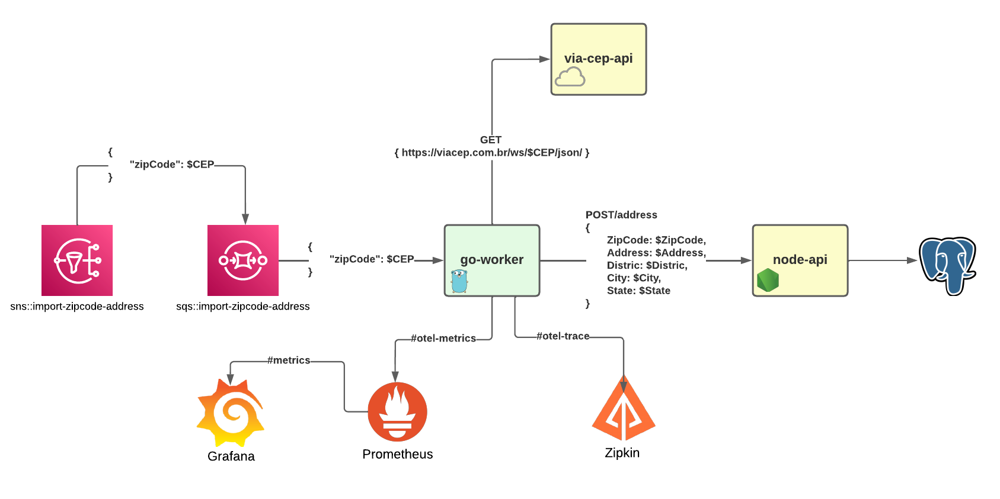

# Opentelemetry Metrics and Trace.

# How to run

## 1 - Run docker-compose
    ## docker-compose version: 1.25.0
    $ docker-compose up --build -d

## 2 - Node-api

    ## Node version: v16.10.0 / Npm version: 7.24.0
    $ npm install
    $ npm run start:dev

## 3- Go-worker
    ## Go version: 1.19
    $ run make deps
    $ go run main.go

## 4 - Configure aws CLI profile
    ## AWS cli version: 2.2.5
    $ aws configure set aws_access_key_id "localstack"
    $ aws configure set aws_secret_access_key "localstack"
    $ aws configure set region "us-west-2"
    $ aws configure set output "json"

## 5 - Publish SQS message

    $ aws sns publish --endpoint-url=http://localhost:4566 --topic-arn arn:aws:sns:us-west-2:000000000000:import-zipcode-address --message '{ "zipCode": "01001000" }' --profile localstack --region us-west-2

    $ aws sns publish --endpoint-url=http://localhost:4566 --topic-arn arn:aws:sns:us-west-2:000000000000:import-zipcode-address --message '{ "zipCode": "49030340" }' --profile localstack --region us-west-2`

# Observability

- Grana URL: http://localhost:3002/
    - User: admin
    - Password: admin
    - Import dashboard: ./grafama-importer.json

- Prometheus URL: http://localhost:9090/